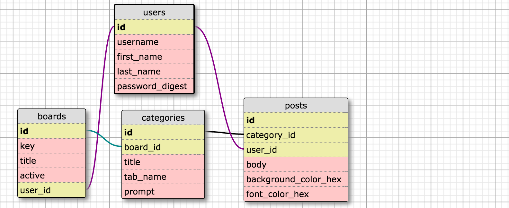

# Shout Out Board
## Overview
This a hobby project used by my Girls Who Code students to post "shout outs" from a classroom PC to a class "board" projected on a big screen. The class "board" gets populated in real time.

- See [here](http://imgur.com/a/sF33D) to see some Balsamiq mockups.
- See [here](http://shoutout.peicodes.com/boards/semicolon) for some actual shoutouts from my class! First load may be slow due to the web dyno awakening from slumber.

Built with Ruby on Rails and ReactJS. Hosted on Heroku.

## Setup

1. Clone, set up DB, start server.

  ```
  > git clone https://github.com/girb0t/shout_out_board.git
  > cd shout_out_board
  > rake db:create
  > rake db:migrate
  > rails s
  ```
  visit ```localhost:3000```

2. Run tests:

  ```
  > rspec
  ```

## How To

### Create a Board
path: ```/boards/new```

Create a board for students to post to. You must be logged in to create a board. A board consists of:
- Key: Must be unique and at least 4 characters.
- Topic Count: Each board can have 1-3 topics (called 'categories' in the back-end).
- Categories: Each category consists of:
  * Title: The column header on the boards#show page
  * Tab Name: The name of the tab on the posts#new page
  * Prompt: The question/prompt asked to the student on the posts#new page

TODO:
- Make note that key is case sensitive.

### Post to a Board
1. Visit root path.
2. Enter board key set when board was created.
3. Write and submit post. Since some of the girls were learning CSS, I decided to add a fun feature where they could change the color and background color of their posts using color hexes.


### Show a Board
Visit ```/boards/:key```. This board gets updated in real time for students to see. This is done using long-polling, but I hope to implement WebSockets some time in the future.

## Misc.

### DB Schema

